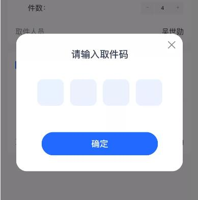

# wx_codeInput
微信小程序验证码输入框

### 项目截图


### 一、基本使用
- **index.json：**

```text
"usingComponents": {
    "code-input": "/components/code-input/index"
}
```

- **wxml：**

```text
<code-input length="4"></code-input>
```

### 二、Props
```text
length  输入块数量

value   初始值

autoFocus   是否自动聚焦于首个输入块

adjustPosition  键盘弹起时，是否自动上推页面 默认false

password    用"·"代替数字

holdKeyboard    focus时，点击页面的时候不收起键盘 默认true

inputAreaItemTapClear   点击输入块时，是否删除原有值 默认true

backgroundColor     组件背景颜色 默认#fff

spacing     输入块之间间距 默认10rpx

inputAreaItemWidth  输入块宽度 默认80rpx

inputAreaItemHeight     输入块高度 默认80rpx

inputAreaItemRadius     每个输入块圆角 默认10rpx

inputAreaItemBackgroundColor    每个输入块的背景颜色 默认#EBF1FF

inputAreaItemFontColor  每个输入块的文字颜色 默认#3d3d3d

cursorColor     光标颜色 默认#3d3d3d
```

### 三、Events
```text
bind:focus      聚焦事件 event.detail
bind:blur      失焦事件 event.detail
bind:compelete       输入完成 event.detail
bind:input      输入事件 event.detail
```

### 四、this.selectComponent(String selector)
- **index.wxml：**
```text
<!--wxml-->
<code-input id="code_input" length="4"></code-input>
```
- **index.js：**
```text
<!--index.js-->
const codeInput = this.selectComponent("#code_input")

console.log(codeInput.isFocus)   //true or false 是否处于聚焦状态
console.log(codeInput.active)   //当前活动的索引
console.log(codeInput.getValue)   //获取当前输入的值

codeInput.closeKeyboard() //关闭键盘
```